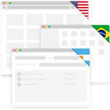

# Langy

Langy is a Mac OS X app which helps you changing your keyboard language per app. You can select which language to use for your desired apps, and a default language to fallback and Langy will automatically change it on focus.

For more info you can check the [site](http://langyapp.github.io/) or you can download it from [here](https://github.com/LangyApp/Langy/releases/download/1.0.0/Langy.zip).

See it in action!

## Getting help

If you have any issues of feature requests, you can add them [here](https://github.com/LangyApp/Langy/issues), or send us an email to langyapp@gmail.com.

We are happy to help.

## Donate

Help us do more stuff!

Langy is a free app we made to learn. We enjoy doing this and will like to do more stuff. 

Everything from a shout on Twitter, a star on Github or donating what you want [here](http://langyapp.github.io/donate.html) helps a lot!

